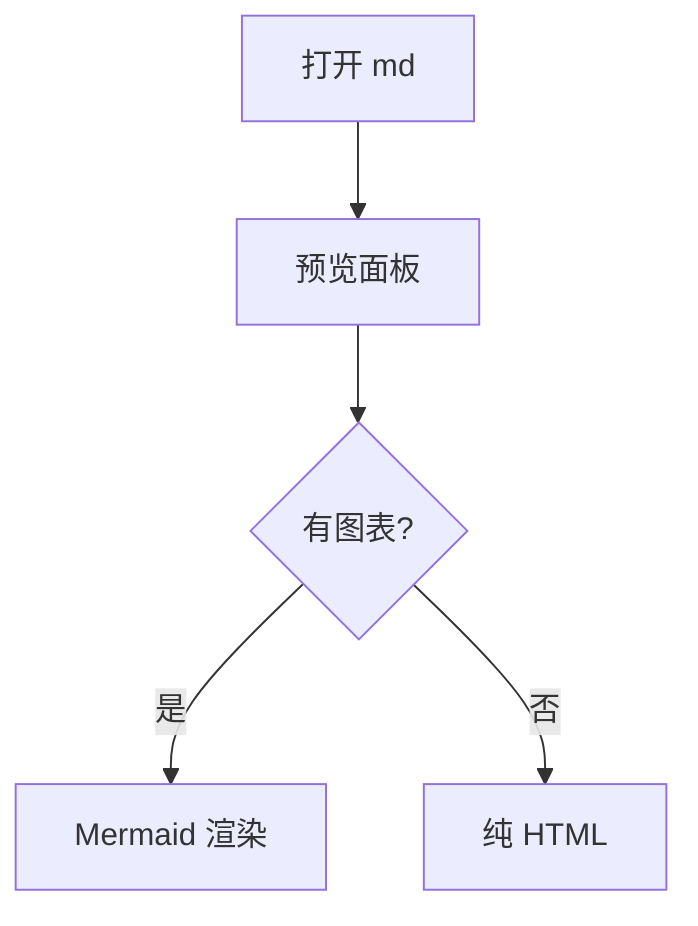
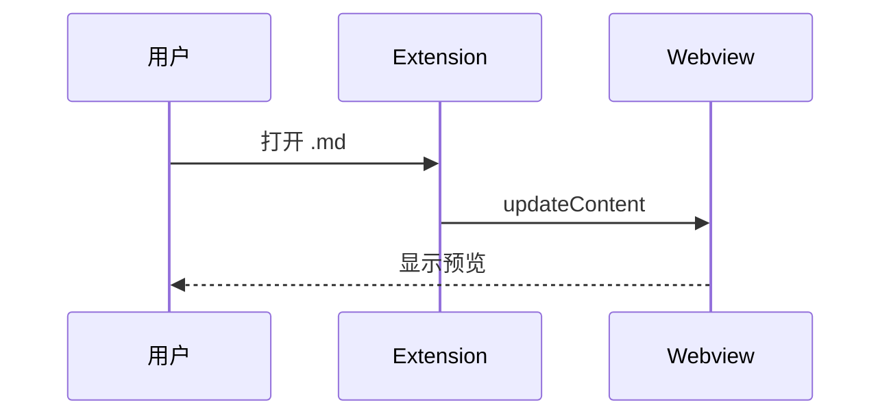
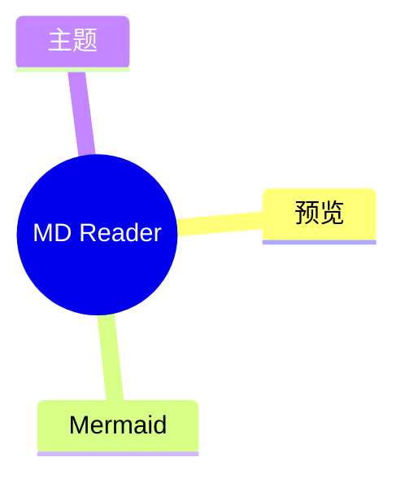

# MD Reader 日常验收

用于装包后手测预览、主题与 Mermaid。

## 段落与列表

普通段落文字。支持 **粗体**、*斜体*、~~删除线~~。

- [x] 已完成任务
- [ ] 待办任务

## 表格

| 列 A | 列 B |
| --- | --- |
| 1 | 甲 |
| 2 | 乙 |

## 代码

```ts
const hello = 'world';
console.log(hello);
```

## Mermaid flowchart



## Mermaid sequence



## Mermaid mindmap


