# MD Editor · 软件开发全量验收

> **唯一验收样例**：排版 / 标签切换 / 源码回写 / Mermaid / 长文滚动。  
> 打开后顶栏 **源码 | 预览** 切换；默认看 **预览**。

版本：0.1.0 · 日期：2026-07-25 · 编码：UTF-8

---

## 0. 验收清单

- [x] 用 MD Editor 打开（非纯文本）
- [x] 顶栏「源码 | 预览」
- [ ] 标题 / 列表 / 表格 / 代码 / 引用正常
- [ ] 任务列表 checkbox
- [ ] 架构 / 时序 / 类图 / 状态 / ER / CI 甘特 / 思维导图 有图
- [ ] 故意错误 Mermaid 有错误提示、不白屏
- [ ] 源码改 `EDIT_ANCHOR` 后预览更新
- [ ] 长文可滚动到底

**编辑锚点（测回写）：** `EDIT_ANCHOR`

---

## 1. 行内与段落

普通段落：**粗体**、*斜体*、***粗斜***、~~删除线~~、`inline code`。

链接：[仓库](https://github.com/HOLYGITHUBUSER/vscode_md_reader) · https://x.ai · [跳到 CI](#8-cicd-与发布)

Emoji / 中日韩：🚀 PR review 済み · 한글 · «API» · `user_id` ≠ null

超长标识符：`SuperLongServiceClientFactoryBean_Impl_V2_ForLegacyCompat_0123456789`

---

## 2. 标题层级

## H2 二级

### H3 三级

#### H4 四级

##### H5

###### H6

---

## 3. 列表（需求 / 任务）

### 3.1 无序嵌套

- 后端
  - API Gateway
    - 鉴权
    - 限流
  - 领域服务
- 前端
  - Web
  - App

### 3.2 有序

1. 拉需求
2. 设计评审
3. 开发 / Code Review
4. CI 通过
5. 灰度 → 全量

### 3.3 任务看板

- [x] Spec 评审
- [x] 脚手架
- [ ] 核心 API
- [ ] E2E
- [ ] 上线 checklist
- [x] 混合 **粗体** 与 `ticket-123`

---

## 4. 引用与注意

> **ADR 摘要**：Custom Editor 内顶栏切换源码/预览，不左右分栏。  
>
> > 嵌套：Webview 负责 Mermaid；Host 负责 `WorkspaceEdit` 回写。

---

## 5. 代码（多语言）

### TypeScript · 扩展入口

```ts
import * as vscode from 'vscode';

export function activate(ctx: vscode.ExtensionContext) {
  ctx.subscriptions.push(
    vscode.window.registerCustomEditorProvider(
      'md-editor.editor',
      new PreviewProvider(ctx),
      { webviewOptions: { retainContextWhenHidden: true } }
    )
  );
}

// XSS 探测（应在代码块内转义显示）
const probe = '';
```

### Python · 服务

```python
from fastapi import FastAPI, Depends
from pydantic import BaseModel

app = FastAPI(title="Order Service")

class CreateOrder(BaseModel):
    user_id: str
    sku: str
    qty: int

@app.post("/orders")
async def create_order(body: CreateOrder):
    return {"ok": True, "id": "ord_01"}
```

### SQL

```sql
SELECT o.id, o.status, u.email
FROM orders o
JOIN users u ON u.id = o.user_id
WHERE o.created_at >= NOW() - INTERVAL '7 days'
ORDER BY o.created_at DESC
LIMIT 50;
```

### Shell · 发布

```bash
#!/usr/bin/env bash
set -euo pipefail
npm test
python3 03-script-构建脚本/build-编译打包.py
code --install-extension 07-artifacts-安装包/md-editor-v*.vsix --force
```

### JSON · 配置

```json
{
  "name": "md-editor",
  "contributes": {
    "customEditors": [{ "viewType": "md-editor.editor", "priority": "default" }]
  }
}
```

### 宽 pre（横向滚动）

```text
METHOD  PATH                    SERVICE           LATENCY_P99  ERROR_RATE  OWNER
GET     /v1/users/{id}          user-svc          42ms         0.01%       team-a
POST    /v1/orders              order-svc         120ms        0.05%       team-b
GET     /v1/orders/{id}/items   order-svc         80ms         0.02%       team-b
PUT     /v1/inventory/reserve   inventory-svc     200ms        0.10%       team-c
```

---

## 6. 表格

### 6.1 服务清单

| 服务 | 语言 | 端口 | SLO | 状态 | 备注 |
| --- | --- | ---: | --- | :---: | --- |
| api-gateway | Go | 8080 | 99.9% | ✅ | 入口 |
| user-svc | TypeScript | 3001 | 99.5% | ✅ | |
| order-svc | Java | 8088 | 99.5% | ⚠️ | 迁移中 |
| inventory-svc | Go | 8090 | 99.0% | ✅ | |
| `payment-svc` | Kotlin | 8091 | 99.9% | ❌ | 熔断演练 |

### 6.2 对齐

| 接口 | QPS | 延迟 ms |
| --- | ---: | ---: |
| GET /health | 1000 | 3 |
| POST /orders | 200 | 95 |
| GET /orders/{id} | 500 | 40 |

---

## 7. 软件架构 · Mermaid

### 7.1 系统上下文（flowchart）

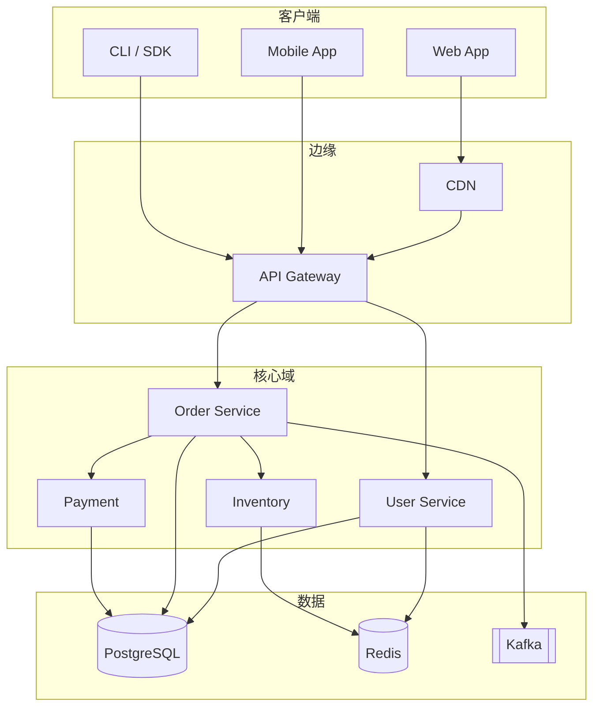

### 7.2 请求时序（下单）

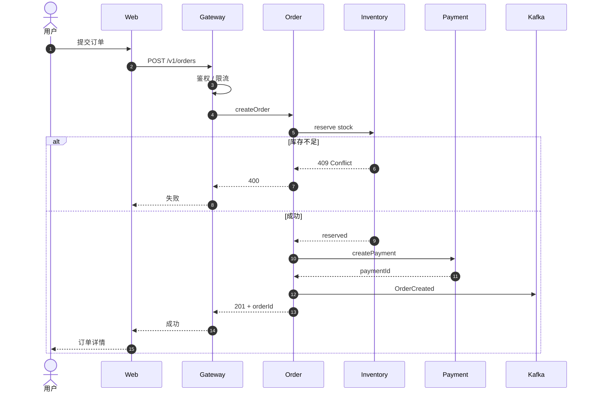

### 7.3 领域类图

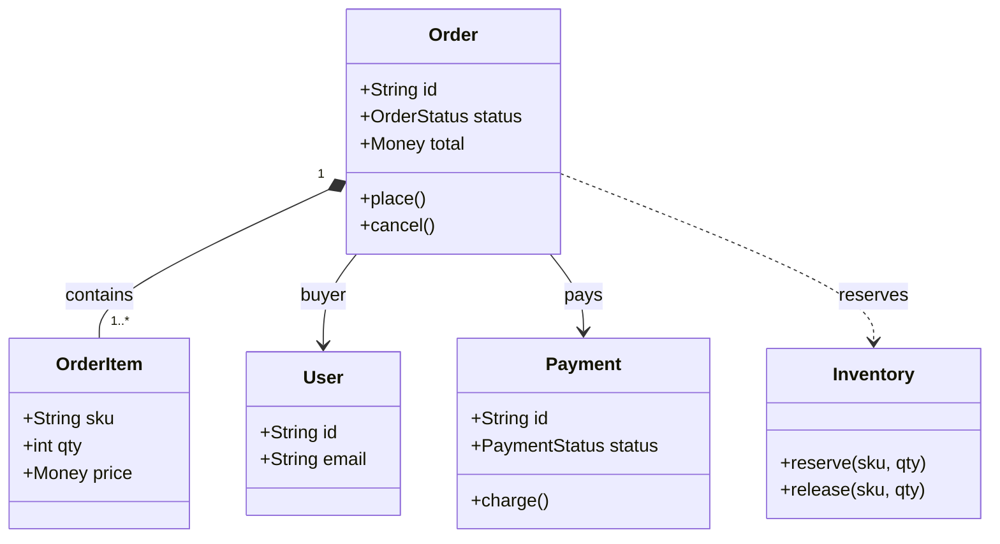

### 7.4 订单状态机

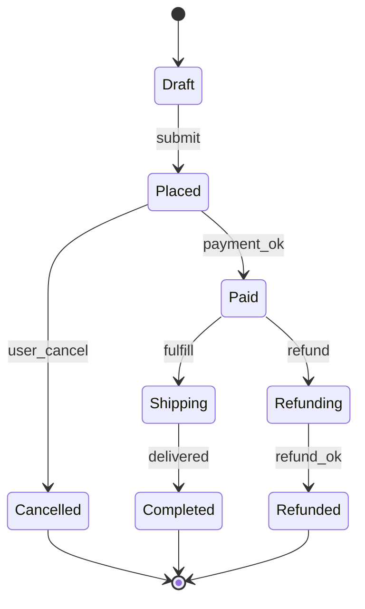

### 7.5 数据模型 ER

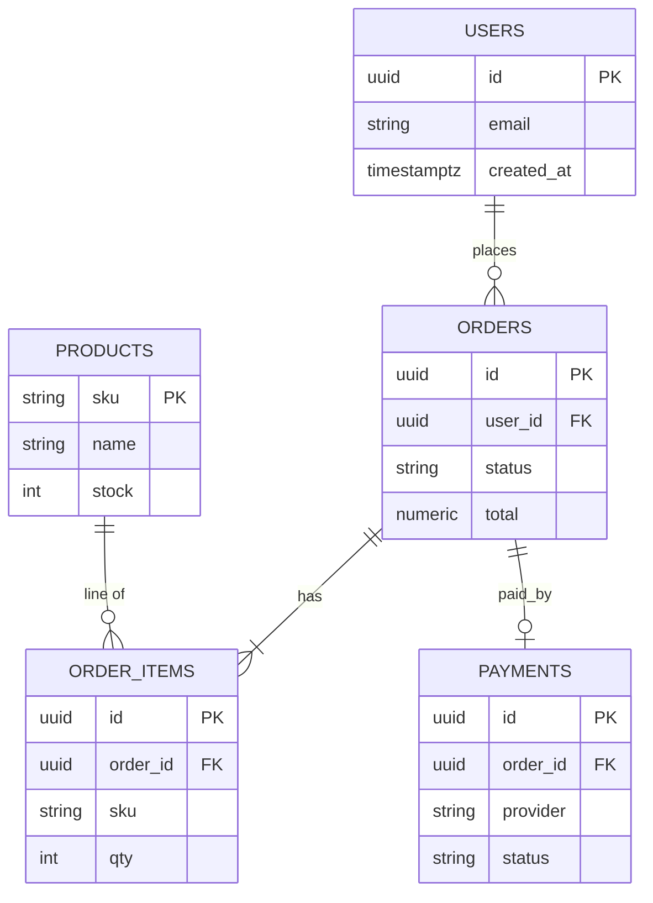

### 7.6 Git 分支策略

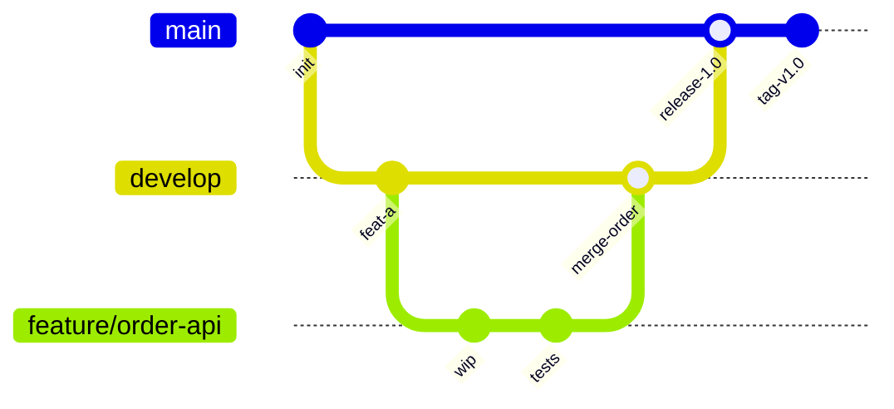

### 7.7 CI/CD 甘特

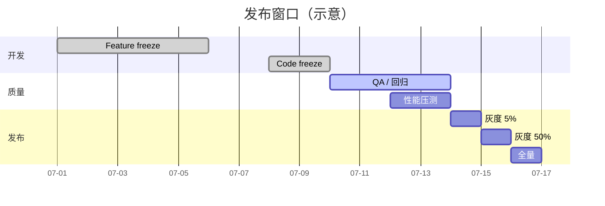

### 7.8 流量占比（pie）

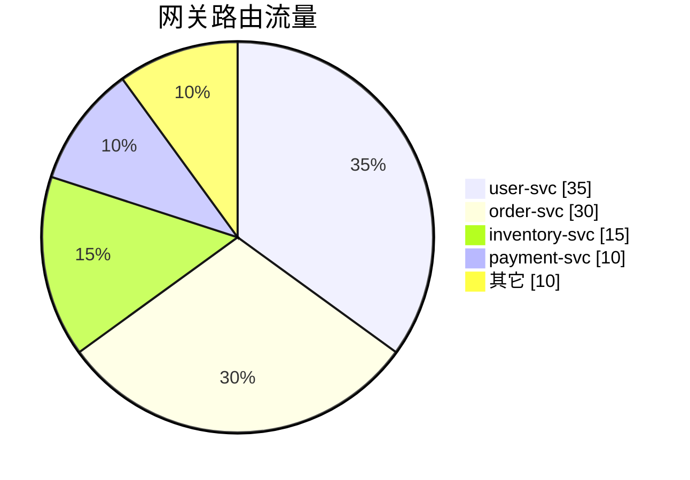

### 7.9 模块思维导图

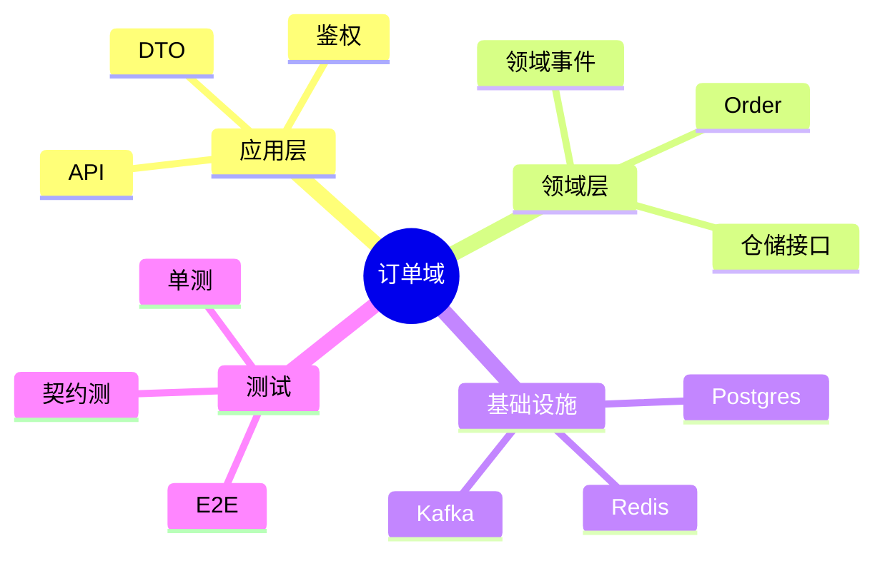

### 7.10 C4 风格容器图

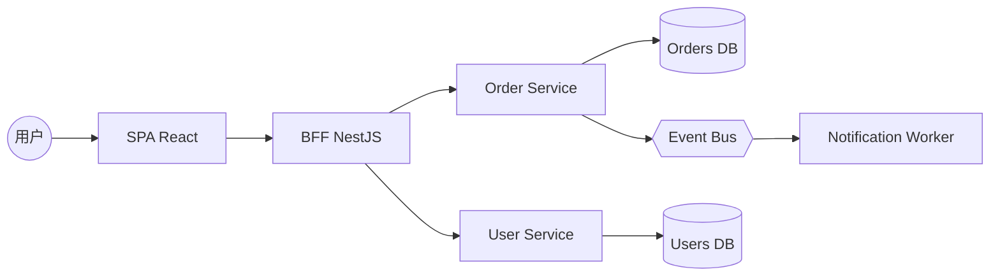

### 7.11 部署拓扑

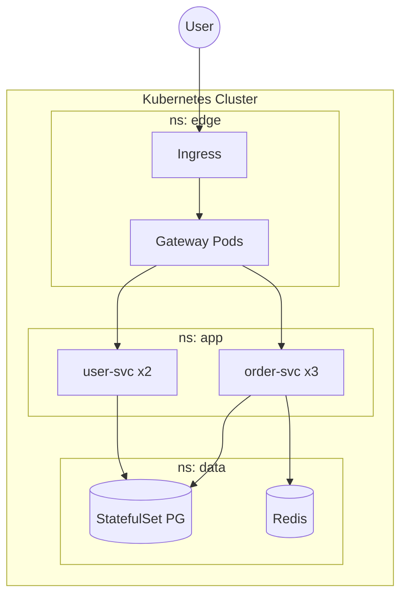

### 7.12 错误图（应显示错误框，不要大红炸弹炸全页）

```mermaid
graph TD
  THIS IS NOT VALID MERMAID [[[
```

---

## 8. CI/CD 与发布

### 8.1 Pipeline 文本

```text
git push → lint → unit → build → e2e → package vsix → publish artifact → notify
```

### 8.2 发布 checklist

- [ ] CHANGELOG 已写
- [ ] 版本号已 bump
- [ ] 单测 / E2E 绿
- [ ] 灰度观察 30min
- [ ] 回滚包已准备

---

## 9. API 契约摘录

```http
POST /v1/orders HTTP/1.1
Host: api.example.com
Authorization: Bearer <token>
Content-Type: application/json

{
  "sku": "SKU-1001",
  "qty": 2
}
```

响应：

```json
{
  "id": "ord_01HZX",
  "status": "PLACED",
  "total": { "amount": "199.00", "currency": "CNY" }
}
```

---

## 10. 排障 Runbook

| 症状 | 可能原因 | 动作 |
| --- | --- | --- |
| 预览空白 | 扩展未激活 / 未 Reload | Reload Window |
| Mermaid 无图 | CDN 失败 | 查网络；看错误框 |
| 源码不回写 | debounce / 未失焦 | 等 0.3s 再切预览 |
| 图片裂图 | 相对路径不存在 | 换 https 或放资源 |

> **On-call**：先看 Gateway 5xx，再看 Order P99，再查 Kafka lag。

---

## 11. 长文滚动（压测）

以下用于测滚动与标签切换是否跳顶。

### 11.1–11.15

**块 01** · 服务网格、可观测性、TraceId 贯通。`scroll-01`  
**块 02** · 蓝绿发布与金丝雀。`scroll-02`  
**块 03** · 限流、熔断、舱壁。`scroll-03`  
**块 04** · 幂等键与去重表。`scroll-04`  
**块 05** · 分布式事务：Outbox。`scroll-05`  
**块 06** · 中段锚点：记下位置 → 切源码 → 回预览。`scroll-06-MID`  
**块 07** · Schema 演进与兼容。`scroll-07`  
**块 08** · 多租户隔离。`scroll-08`  
**块 09** · 密钥轮换。`scroll-09`  
**块 10** · SLI / SLO / 错误预算。`scroll-10`  
**块 11** · 容量规划。`scroll-11`  
**块 12** · 成本优化。`scroll-12`  
**块 13** · 安全左移。`scroll-13`  
**块 14** · 文档即代码。`scroll-14`  
**块 15** · 平台工程。`scroll-15`

甲乙丙丁戊己庚辛壬癸 · the quick brown fox · 0123456789 重复填充高度：  
开发迭代交付质量稳定性可观测自动化测试持续集成持续部署基础设施即代码。

---

## 12. 图片

相对路径（可裂图）：


https：


---

## 13. 手测步骤（1 分钟）

1. Reload Window  
2. 打开本文件 → 确认 **预览** 标签  
3. 滚到 §7 看架构/时序/类图  
4. 看 §7.12 错误图是否有错误提示  
5. 切 **源码**，改 `EDIT_ANCHOR` 为 `EDIT_ANCHOR ok`  
6. 切回 **预览**，应看到更新  
7. 滚到文末本行  

---

## 14. 文末

若读到这里：长文与渲染链路正常。

- 文件：`验收-全量样例.md`（本仓库唯一主验收样例）  
- 覆盖：软件架构 / 时序 / 类 / 状态 / ER / git / gantt / pie / mindmap / 部署 / 代码 / 表 / 任务 / 滚动  

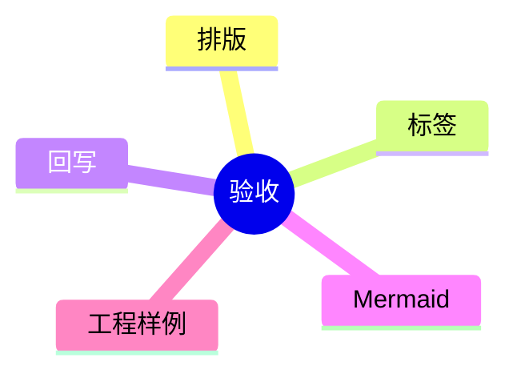

**END · MD Editor Acceptance** ✅
